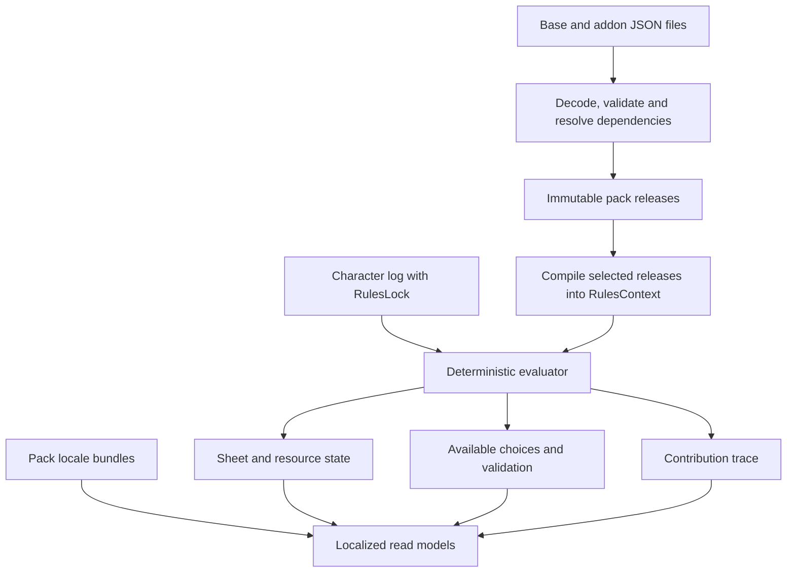

# Pack-based rules and character model — proposal

Status: design record, 2026-09-30. Core implementation now exists; see
[packs.md](packs.md) for the supported format and current behavior. Examples here
remain proposals, not copyable v1 wire contracts. Browser pack selection, homebrew authoring and durable pack storage now exist;
see [packs.md](packs.md#homebrew-authoring). Durable character storage remains later work. Repository
guidance: `CLAUDE.md`.

Note, 2026-10: the generator this record leans on -- `cmd/srdgen`,
`data/rules/2014/`, `data/translations/` -- has been retired. The base pack at
`data/pack/srd-5.1/` is hand-maintained, the loader reads a directory by
layout, and a pack may ship prose for a dependency's entities. The transition
plan below is history; [packs.md](packs.md) says what holds.

Treat **pack** and **addon** as the same artifact. The built-in 2014 rules become
a pack, loaded through the same pipeline as custom packs. A character remains
an ordered stream of decisions and rule applications, evaluated against an
exact, reproducible set of packs.

This work plans the domain, file format, loader, projection, compatibility and
migration changes. Pack editors, upload/publishing endpoints, authoring CRUD,
marketplaces and new UI/UX are deferred. A future editor must produce the same
JSON that a person can write by hand; it must not introduce a second rules format.

## What the current code already provides

| Area | Current behavior | Required change |
| --- | --- | --- |
| Catalogue | Typed collections in `internal/domain/catalog`; `rules.Ref` is `kind:slug` | Pack-qualified identity and a resolved rules context |
| Files | `internal/adapter/catalog/file` reads generated mechanics and locale overlays | Versioned manifest, optional collections, validation, dependencies and export |
| Startup | `internal/app/app.go` eagerly loads the default SRD locale; other locales are cached lazily | Validate and compile all configured releases before accepting requests |
| Character | `Project` and `Prompts` derive a sheet and choices from a log | Pin rules context; share rule evaluation between both functions |
| Edits | Append, truncate, or revise and revalidate the suffix | Preserve this build workflow by default; distinguish it from an immutable audit history |
| Resources | Fixed spell-slot array, hit-dice pools, generic class pools | Resource definitions, separate derived values, progression, recovery and costs |
| Casting | `spellcasting.go` infers caster kind from the level-20 table; multiclass slots use the wizard table | Explicit casting profiles, contribution policies and independent tables |
| Mechanics | Darkvision mapping, proficiency formula, ability generation, ASI prompts and other rules are in code | Move game-specific choices and formulas into base-pack JSON |
| Localization | Per-key English fallback; runtime locale list is hardcoded to English/Russian | Discover pack locales; use a default locale per pack |
| Storage | Characters, folders, shares and games are in memory; accounts/groups use PostgreSQL | Retain that distinction in planning; durable character replay also needs durable logs and pack releases |
| Browser | Resource labels and ability-generation constants are hardcoded | Later consume pack metadata and server-provided policies |

Two specific gaps matter. `addClassResources` copies counts and dice but not
recovery policy or `LevelResource.Text`. It therefore cannot faithfully represent
all the values in the input. Also, `expectedSeq` is not a sufficient concurrency
token when a revision can preserve the number of events: use a monotonically
increasing record revision for every log write.

## The target model



| Concept | Responsibility |
| --- | --- |
| `PackManifest` | Stable pack ID, release version, format version, rules system/edition, engine requirements, dependencies, files, locales, source/attribution |
| `PackRelease` | Immutable decoded content and verified digest for one release |
| `EntityRef` | Pack ID + entity kind + stable local ID; display names never identify content |
| `RuleDefinition` | Stable rule ID, activation condition, typed effects and choices |
| `Progression` | Typed table or expression with an explicit input such as class level |
| `ResourceDefinition` | Capacity, optional per-use die/slot metadata, recovery, merge policy and presentation metadata |
| `CastingProfile` | Spell access, casting ability, slot sources and multiclass contribution |
| `RulesLock` | Exact transitive pack releases/digests, edition, engine semantics and composition choices |
| `RulesContext` | Immutable compiled mechanics for a lock, independent of locale |
| `Contribution` | Derived explanation: event ID, rule ID, entity ref and affected value |

Keep typed races, classes, subclasses, traits, features, spells and equipment.
Attach common rule/effect capabilities to them instead of replacing everything
with an untyped JSON object. Tools remain equipment with categories and
proficiencies; new tool entries need no new Go type. Traits and class features
remain distinct so their origin stays visible.

“Abilities” means new features/actions here. Character ability scores remain
STR, DEX, CON, INT, WIS and CHA. Packs can grant bonuses to those scores but
cannot add custom characteristics. This replaces the original proposal for
additional scores following the user's review of the demo.

New entity instances and combinations of supported effects require only JSON.
A fundamentally new operation still requires a versioned engine capability.
Reject unsupported operations during loading; never accept them and silently
ignore their mechanics. Prose-only features may explicitly declare manual
resolution, which must be visible in their read model.

## Pack identity, composition and JSON

Use a canonical reference such as `srd-2014:class:warlock` or
`home-example:resource:combat-dice`. Internally use a typed structure, not string
splitting throughout the domain. Pack IDs and local IDs use a documented grammar;
IDs do not change when labels or translations change. Version belongs in the
lock, not in every reference. Only one version of a given pack participates in
one context, although the server can retain several versions simultaneously.

The directory representation is convenient for Git:

```text
data/packs/srd-2014/1.0.0/
  manifest.json
  entities/classes.json
  entities/spells.json
  entities/features.json
  rules/core.json
  rules/resources.json
  rules/casting.json
  tables/progressions.json
  i18n/en.json
  i18n/ru.json
```

Support a single-file envelope containing `manifest`, `entities`, `rules`,
`tables` and `locales` too. Both forms normalize to exactly the same logical pack.
An export followed by an import must preserve all supported content and IDs;
translation bundles and attribution are part of the artifact. Dependencies remain
references by default; a separate bundle envelope may include their exact
releases for offline transfer. Neither form embeds executable scripts.

Illustrative manifest fragment (the schema and field names are proposed):

```json
{
  "schemaVersion": 1,
  "id": "home-example",
  "version": "1.0.0",
  "system": "dnd5e",
  "edition": "2014",
  "engine": {
    "semantics": "1",
    "requires": ["effects.v1", "progressions.v1", "resources.v1"]
  },
  "dependencies": [{"id": "srd-2014", "version": ">=1.0.0 <2.0.0"}],
  "defaultLocale": "en",
  "locales": ["en", "ru"],
  "files": {
    "entities": ["entities/subclasses.json"],
    "rules": ["rules/resources.json"],
    "locales": {"en": "i18n/en.json", "ru": "i18n/ru.json"}
  }
}
```

Resolution rules:

1. Resolve only configured/installed releases. Dependency constraints may use
   ranges, but a character lock records exact versions and digests. Startup
   should not fetch dependencies from the internet.
2. Reject duplicate identities within a release, dependency cycles, missing or
   incompatible dependencies, unknown references and unsupported capabilities.
3. Different packs may both define `spell:fireball`; their qualified refs differ.
   Duplicate full refs are errors, never last-file-wins.
4. Additions are the default. A subclass points to its parent class; build the
   parent's available subclasses from the reverse index. Adding a subclass must
   not require modifying the parent's release. Use explicit extension points
   for spell lists, choice pools and similar relationships.
5. Overrides are explicit operations with a target ref/rule, compatible target
   version and preconditions. Prefer typed operations such as
   `extendChoice`, `grantRule` and `replaceRule` over arbitrary array patches.
   Conflicting replacements require an explicit selection in the lock or fail.
   File order must never decide which rule wins.
6. Resolve and validate the full selected graph before atomically publishing a
   context. Reference graphs can contain legitimate back-references; only
   dependency/evaluation cycles that cannot be executed deterministically fail.

Validate the wire shape using [JSON Schema Draft 2020-12](https://json-schema.org/draft/2020-12),
then perform semantic checks in Go. Schema validation alone cannot prove that a
reference exists, a progression is total, or two effects can compose. Use a fixed
local schema registry, bounded input sizes/depth, duplicate-key rejection and
paths restricted to the pack root. Domain types remain free of JSON tags and
schema-library imports, following the existing layer rules.

## Rules as data, with a small deterministic engine

The engine implements typed operations; the pack supplies game policy. Initial
operations should cover grants, choices, prerequisites, stat modifiers, derived
values, resource grants, casting profiles and action costs. Base JSON contains
the ability modifier formula, proficiency progression, ability generation,
starting/multiclass grants, advancement, senses, armor formulas, spell-slot tables
and recovery policies. Arithmetic, bounded expression evaluation, reference
resolution and event ordering remain code.

Use a typed expression tree: constants, references, arithmetic, min/max,
floor/ceil, comparisons, boolean combinations and table lookup. Avoid arbitrary
Go/JavaScript/Lua execution. Expressions declare what they read and their result
type; validate the graph and reject cycles. Dice expressions describe dice;
replay never rolls them. Actual roll results must be recorded as event facts.

Each progression names its input: total character level, a particular class's
level, an ability modifier, proficiency bonus or a choice. Subclass progressions
normally use **parent class level**, not total character level or a fabricated
subclass level. A threshold table picks the last row whose minimum is met;
exact tables require every supported input. Missing rows and out-of-range inputs
are validation errors unless the table declares a fallback. Rational values such
as challenge rating 1/4 stay rational, rather than being rounded into integers.

Order evaluation explicitly: decisions and base inputs → active grants/choices
→ abilities and levels → dependent statistics → capacities/actions → temporal
resource state. Preserve current DM override behavior through typed,
phase-specific adjustments with provenance. A stat with multiple contributions
declares its combination policy: sum, maximum, union, alternative formulas with
a selection, or explicit replacement. Never resolve ambiguity by map iteration.

`Project`, `Prompts`, command validation and revision previews must call the same
compiled evaluator. Derive a trace for “why do I have this?” from every grant and
modifier. Do not separately store all calculated effects as authoritative events:
that would duplicate the rules and make later edits apply effects twice.

## Extensible resources, including the difficult cases

Separate three concepts currently mixed in `LevelResource`:

| Concept | Examples | State |
| --- | --- | --- |
| Spendable pool | Spell slots, Channel Divinity, ki, combat dice | Capacity, used count, recovery |
| Derived parameter | Sneak Attack damage, martial arts die, maximum transformation CR | Typed computed value; nothing to spend |
| Action/feature | A maneuver, a spell cast, a Channel Divinity option | Eligibility, cost and effects; references a pool when needed |

Pools are keyed by stable resource instance ID, with their definition and grant
origin retained. Display grouping such as “spell slots” or “class resources” is
metadata. No resource identity is inferred from its label, array position or a
prefix such as `pact-magic-level-`.

A definition includes:

- Kind, localization keys and optional display group/order.
- Activation rule and capacity expression/progression.
- Optional per-use die, spell level, or other typed metadata.
- Recovery policies: trigger, condition, amount and cap. Multiple policies are
  allowed. Partial recovery and player allocation are first-class.
- Sharing policy: independent by grant, or an explicit shared pool with a
  declared capacity combination. Equal display names do not merge pools.
- Spending constraints and actions that may use the pool.

Level changes recalculate capacity without resetting spent uses. Keep `used`
when capacity shrinks and derive `available = max(0, capacity - used)`. A resource
that disappears cannot be spent; preserve its earlier events for validation and
history. A rule that intentionally resets usage must say so explicitly.

The model must express these cases:

| Case | Pack representation |
| --- | --- |
| Ordinary spellcasting | Slot family indexed by spell level; per-class single-caster tables and an explicit shared multiclass table |
| Warlock Pact Magic | Independent pool with class-level-based capacity and slot-level metadata; short/long-rest recovery; no contribution to the ordinary slot table |
| Paladin Channel Divinity | Pool activated by the oath grant, with several actions drawing from the same uses |
| Fighter special dice | Subclass-granted pool with independently scaling capacity and per-use die size; maneuver choices reference its cost |
| Hit Dice | Pools retaining die-size/grant identity; partial recovery can allocate a shared budget across pools |
| Sneak Attack | Scaling damage parameter, with usage eligibility represented separately |
| Ability-based pool | Capacity expression such as `max(1, abilityModifier)` and a separate die progression |

For the 2014 baseline, the warlock's pool changes both size and slot level, while
Paladin Channel Divinity is one shared use per short or long rest once granted.
These are separate mechanics despite both being resources. Verify the built-in
definitions against the [official SRD 5.1](https://media.wizards.com/2023/downloads/dnd/SRD_CC_v5.1.pdf)
and the vendored data. A fighter dice addon below is an illustrative custom
definition, not additional content claimed to be present in the SRD.

For example, Pact Magic uses the same pool shape with slot metadata rather than
a die. These thresholds match the current generated warlock class rows:

```json
{
  "id": "srd-2014:resource:pact-magic",
  "kind": "pool",
  "nameKey": "resources.pactMagic.name",
  "grant": {"owner": "srd-2014:class:warlock", "minimumClassLevel": 1},
  "progression": {
    "input": {"classLevel": "srd-2014:class:warlock"},
    "mode": "threshold",
    "rows": [
      {"from": 1, "capacity": 1, "slotLevel": 1},
      {"from": 2, "capacity": 2, "slotLevel": 1},
      {"from": 3, "capacity": 2, "slotLevel": 2},
      {"from": 5, "capacity": 2, "slotLevel": 3},
      {"from": 7, "capacity": 2, "slotLevel": 4},
      {"from": 9, "capacity": 2, "slotLevel": 5},
      {"from": 11, "capacity": 3, "slotLevel": 5},
      {"from": 17, "capacity": 4, "slotLevel": 5}
    ]
  },
  "recovery": [
    {"trigger": "short-rest", "operation": "restore-all"},
    {"trigger": "long-rest", "operation": "restore-all"}
  ],
  "sharing": {"mode": "independent-by-grant"}
}
```

Its casting profile identifies this as an eligible slot source and specifies
zero contribution to the ordinary multiclass slot progression. Higher-level
separate-use features such as Mystic Arcanum get their own grants; they do not
turn into extra levels in this pool.

Paladin Channel Divinity is a fixed-capacity grant into a shared resource:

```json
{
  "id": "srd-2014:rule:paladin-channel-divinity",
  "owner": "srd-2014:class:paladin",
  "activation": {"minimumClassLevel": 3, "requiresSubclass": true},
  "effects": [{
    "op": "grantResource",
    "resource": "srd-2014:resource:channel-divinity",
    "capacity": 1,
    "sharing": {"key": "srd-2014:channel-divinity", "combineCapacity": "max"}
  }]
}
```

The referenced resource declares short/long-rest restoration. Each oath option
declares a cost of one use from that resource. A cleric grant contributes its
own capacity to the same explicitly shared pool; the maximum policy prevents
the paladin grant from adding an unintended extra use.

A custom fighter subclass can instead grant a pool of dice:

```json
{
  "id": "home-example:resource:combat-dice",
  "kind": "pool",
  "nameKey": "resources.combatDice.name",
  "grant": {
    "owner": "home-example:subclass:tactician",
    "minimumClassLevel": 3
  },
  "progression": {
    "input": {"classLevel": "srd-2014:class:fighter"},
    "mode": "threshold",
    "rows": [
      {"from": 3, "capacity": 4, "die": {"count": 1, "faces": 8}},
      {"from": 7, "capacity": 5, "die": {"count": 1, "faces": 8}},
      {"from": 10, "capacity": 5, "die": {"count": 1, "faces": 10}},
      {"from": 15, "capacity": 6, "die": {"count": 1, "faces": 10}},
      {"from": 18, "capacity": 6, "die": {"count": 1, "faces": 12}}
    ]
  },
  "recovery": [
    {"trigger": "short-rest", "operation": "restore-all"},
    {"trigger": "long-rest", "operation": "restore-all"}
  ],
  "sharing": {"mode": "independent-by-grant"}
}
```

The `die` describes one use. Capacity four with a d8 means four available uses,
each rolling 1d8; it must not accidentally become four uses of 4d8. Below the
grant level the resource is absent. A new pack can change the thresholds, die,
count, or recovery without adding a class-specific branch to Go.

Casting profiles must explicitly describe contribution rate and rounding, when
contribution starts, and whether rounding occurs per contribution or after a
sum. Include full, half, third and independent progression examples in tests.
Keep known/prepared spell eligibility separate from slot capacity: access to a
high-level slot does not itself grant access to spells of that level. Slot
substitution is an explicit spending policy, so a qualifying spell may use a
Pact Magic pool without merging its capacity or recovery with ordinary slots.

For cross-class shared features, the base pack defines the merge rule. In
particular, the 2014 multiclass Channel Divinity rule shares available uses while
retaining the effects each class granted; two independently named grants must
not accidentally double the capacity. Confirm this and partial Hit Dice
recovery against the [SRD multiclassing and rest rules](https://media.wizards.com/2023/downloads/dnd/SRD_CC_v5.1.pdf).

## Character events and reproducible evaluation

Keep the existing editable construction log, as confirmed during planning. The product currently
supports changing an earlier choice and replaying the suffix; a strict
append-only audit log would change that contract. This proposal preserves the
workflow and pins each build to its exact rules context.

Extend the log envelope/init with its `RulesLock`. Events carry a stable event
ID, schema version, sequence, typed rule/entity reference, choices, recorded
inputs and optional provenance. Keep `Source` as the current prompt group;
add separate fields for pack/rule origin rather than changing its meaning.
Prompt instance IDs include the stable rule/choice ID and occurrence (for
example class level or grant event), so the same feature granted twice cannot
collide. Option IDs are authored and stable, never derived from array indexes.

Continue recording semantic decisions such as selecting a race, taking a class
level or answering a feature choice. Generalize them to a `rule.applied` family
where the pack rule determines the effect; existing event types can remain as
compatibility aliases. The server checks that the rule is currently offered and
validates its arguments. Clients cannot apply arbitrary loaded rules merely by
knowing their IDs. The normal path does not submit unverified calculated grants.

Runtime event contracts should support `resource.spent`, `resource.recovered`
and `rest.completed`, even though battle controls are deferred. A command that
pays a cost and applies an action commits atomically. Recovery events record any
rolls or player allocation; a rest uses an explicit game trigger and never the
server's wall clock. Declare whether one trigger implies another and prevent
double recovery when both match.

Replay temporal operations at their actual position: a spend must be checked
against the capacity and rules available at that point, not against the final
character level. Revising earlier construction choices revalidates all affected
later operations too. Do not silently discard combat spending during a respec;
return the invalidated operations for explicit resolution. While combat is not
built, keep this boundary in the core design and fixtures.

Add `expectedRevision` to writes and increment it for append, truncate, rewrite
and rules migrations, even when sequence count is unchanged. Add command IDs for
retry deduplication. Continue storing small logs together initially; this design
does not require a message broker or an event-store product.

## Updating and versioning: recommended policy

These are separate version axes:

| Axis | What it changes |
| --- | --- |
| Pack `version` | A release of game content, including translations |
| Pack `schemaVersion` | JSON encoding/structure |
| Engine semantics/capabilities | Meaning and availability of evaluation operations |
| Event schema version | Persisted event payload structure |
| Rules edition | Game family/edition; 2014 vs a future 2024 pack |
| Character record revision | Optimistic concurrency; never a content version |

Use [Semantic Versioning](https://semver.org/spec/v2.0.0.html) for pack releases,
with a documented public contract covering stable IDs, choices and rule
behavior. Published versions are immutable. Proposed project policy: patch for
text/translation corrections that preserve mechanics, minor for compatible
additions, major for changed existing mechanics or invalidated answers. This is
deliberately conservative; a “balance bug fix” can break a character even if
an author would normally call it a patch. Classification never replaces replay
validation, and no version category is permission to auto-upgrade a character.

Pin exact releases plus SHA-256 content digests. Normalize either file layout
to a logical pack, sort only schema-declared unordered collections, preserve
ordered arrays, and hash its canonical JSON. Exclude the digest field itself.
[RFC 8785](https://www.rfc-editor.org/rfc/rfc8785) provides a JSON canonicalization
scheme; use an implementation with conformance tests instead of relying on Go map
serialization. Use bounded integers and explicit rationals for mechanics. A
digest verifies content identity, not publisher trust.

For v1, translations ship inside the immutable pack release. A translation fix
produces a new patch release. A separate mechanics digest may show that gameplay
is unchanged, but the full release stays pinned. Independently versioned
translation packs can be added later with their own compatibility lock.

| Strategy | Decision |
| --- | --- |
| Always use latest installed content | Reject: a restart could change an existing character |
| Store only computed sheet values | Reject as the core model: loses choices, explanations and recomputation |
| Pin releases and migrate explicitly | Adopt: preserve old builds and preview changed behavior |
| Rewrite all old events whenever format changes | Avoid: preserve original imported/stored payloads and use adapters |

Use pure, chained event upcasters for representation changes and pack format
adapters for old JSON. Upcasting must preserve meaning; choosing a replacement
feat or changing a rule is a character migration, not deserialization. Versioned
events and upcasting are established approaches described in Microsoft's
[event-sourcing guidance](https://learn.microsoft.com/en-us/azure/architecture/patterns/event-sourcing).
The guidance describes immutable histories; our editable build log is a
deliberate product-specific difference.

An upgrade, enabling a pack, disabling one, or changing overrides follows one
transactional workflow:

1. Resolve a candidate lock without touching the current build.
2. Apply explicit entity/prompt/option mappings where a release supplies them;
   never guess from translated labels. Mappings are declarative, not scripts.
3. Replay all decisions under the candidate context; report missing refs,
   invalid choices, changed prerequisites, resource changes and sheet diffs.
4. Keep unresolved builds on their current lock. Dropping a choice or dependent
   pack must be an explicit migration decision.
5. On application, atomically save the new validated log and lock using the
   expected record revision. Retain the pre-upgrade build as an immutable
   checkpoint, with the migration report and mapping version.
6. Rollback restores the matching checkpoint and lock together. If gameplay or
   edits occurred after upgrading, preview a reverse migration or branch from
   the checkpoint; do not silently erase those events.

Historical engine semantics matter as much as JSON. Retain versioned semantic
handlers for supported locks and test their behavior. If semantics must change,
create a new semantic version and migrate explicitly. A lock whose engine is no
longer supported must fail with a useful diagnostic, rather than replaying under
new rules. A last verified sheet may be shown read-only, clearly marked, but it
does not replace replay support.

Retain all releases referenced by live locks or migration checkpoints in a
durable artifact store. Git is the source for built-in packs; retention must not
depend on old application release directories surviving deployment cleanup.
Never fall back to “latest” when an artifact is missing. Derived snapshot caches
include build revision, lock digest and engine semantics; localized responses
also include locale. A snapshot is disposable, not an alternate source of truth.

## Localization

Mechanics never contain translated names as identifiers. Each pack has its own
complete default locale, which need not be English, plus partial overlays.
Localize entity names/descriptions, rule explanations, choices, option labels,
resource labels, actions and pack metadata. Pack-qualified message keys prevent
collisions. The application still owns generic captions such as “remaining”.

Use well-formed BCP 47 language tags and a documented lookup chain following
[RFC 4647](https://www.rfc-editor.org/rfc/rfc4647). Resolve requested locale and
its applicable parents, then the owning pack's default locale, per key. Treat
absence differently from an explicit empty value. Validate required default
keys, extra/misspelled keys and interpolation parameters. Localized text cannot
change expression evaluation or the rules lock.

Discover available content locales from manifests, independently of the
application's translated UI locales. A Russian-only custom pack can still load
in an English UI using its own fallback. Resolve names for cross-pack refs from
the referenced entry's pack. Keep mechanics compiled once and cache localized
views by context digest and negotiated locale. Support only a bounded, documented
text format; an author cannot inject arbitrary HTML through a description.

## Startup, files and future authoring

Replace the single `data.srd_dir` contract with YAML configuration for pack roots,
an installed-release registry/artifact location, and a default rules lock.
Provide a transition adapter for the existing setting. Continue the repository
rule that individual settings are not overridden through environment variables.

Startup reads manifests, validates all declared files/locales, resolves locks,
compiles mechanics and installs immutable contexts before HTTP readiness. A
configured invalid pack fails startup with file/entity/rule diagnostics. Install
new releases atomically; changing a default lock affects new characters only.
Hot reload is unnecessary for the first implementation.

Keep `data/pack/srd-5.1/` generated throughout transition. Extend `cmd/srdgen` and
`make data/srd`, rather than editing generated files. Add a hand-authored input
directory such as `data/rules/2014/` for mechanics missing from the upstream dump;
validate and incorporate it during generation. Preserve
`data/translations/<locale>/` as the translation input. Move output to the pack
layout only with matching generator, configuration, deployment and drift checks.

The codec/compiler is the future authoring boundary: load, validate, compile,
serialize and compare are reusable library operations. Later file uploads and
the UI editor call this same boundary. Mutable drafts get a new immutable release
when published. Private pack access and sharing must eventually be checked before
serving a context; a public content hash alone grants no access. These contracts
can be designed now without building authoring services or screens.

## Changes mapped to the repository

| Location | Planned change |
| --- | --- |
| `internal/domain/rules/{slug,ability,choice,option}.go` | Qualified refs, dynamic score identity, stable choice instances, typed expressions/value objects |
| New `internal/domain/pack/` | Manifest/release/lock types, dependency and composition contracts; no I/O or serialization tags |
| `internal/domain/catalog/{entry,class,race,spell,item,catalog}.go` | Pack provenance, rule attachments, resource/casting definitions, contextual catalogue lookup |
| `internal/domain/character/{event,character,state}.go` | Lock in log, stable event IDs/schema version, revision token, generic resources and separate parameters |
| `internal/domain/character/{project,prompts,grants,answers}.go` | Shared compiled rule evaluation and contribution traces; preserve prefix-based validation |
| `internal/domain/character/{spellcasting,senses,armor,changes}.go` | Move game policy into pack rules; retain reusable evaluation operations and legacy path adapters |
| `internal/adapter/catalog/file/` and new pack codec | Legacy catalogue adapter, schemas, JSON import/export, validation, digests, locale views |
| `cmd/srdgen/`, `data/rules/2014/`, `data/translations/` | Generate base pack and its supplemental mechanics deterministically |
| `internal/usecase/character/{service,validate,revise,import}.go` | Resolve a character's exact context; one validation path; migration preview/apply; imports resolve IDs under an explicit legacy context |
| `internal/usecase/game/service.go` | Read each shared character using its own lock; avoid projecting a mixed roster against the server default |
| `internal/adapter/repository/memory/character.go` | Revision checks, event/lock cloning, migration checkpoints and command deduplication |
| `internal/adapter/repository/postgres/` | Later durable logs, checkpoints, locks and artifact references; plan stable IDs and dependent folders/shares/games together |
| `internal/config/`, `internal/app/app.go`, `config.dev.yaml`, `deploy/config.example.yaml` | Pack configuration and startup compilation |
| `internal/api/http/v1/{catalog,character,game}/` | Pack-qualified refs, lock/revision metadata, contextual catalogue and prompt conversion, structured resource DTOs/errors |
| `web/src/lib/api/{catalog,characters,games}.ts` | Later matching DTOs; cache by context and locale |
| `web/src/domain/{abilities,event}.ts`, character `labels.ts`, `SheetBody.tsx`, forms | Later consume metadata and policy; remove closed resource dictionaries; retain the six standard scores |
| `web/src/features/spells/`, `web/src/features/legal/` | Later qualified spell lookup/assets and per-pack attribution |
| `Makefile`, deployment workflow, `deploy/deploy.sh` | Pack validation/drift checks, shipped artifacts and durable release retention |
| `docs/{dnd,backend,web,licensing}.md` and `README.md` | Update alongside the eventual behavior changes, keeping current documentation truthful until then |

Keep dependency direction inward: `rules` supplies value types; `pack` depends on
those types; `catalog` may depend on pack identity; `character` consumes the
compiled catalogue/context. File decoding lives in adapters. Check both Go and
browser layer rules as packages move.

Existing read endpoints may temporarily expose compatibility projections for
the default base pack. They must not flatten independent pools into one slot
array or strip namespaces from addon refs. Return a versioned/new DTO where a
lossless old representation is impossible. Catalogue rendering and browser caches
currently key primarily by locale/collection; both must gain context identity.
The character prompts handler must convert options using the character's context,
not `Service.Catalog(locale)` for the global default.

## Suggested implementation sequence and acceptance gates

1. **Capture the baseline and freeze contracts.** Catalogue the hardcoded rules;
   save existing character/projection fixtures; specify schemas, qualified IDs,
   lock semantics and editable-log behavior. Include the same-length rewrite
   concurrency regression. No pack authoring endpoints.
2. **Pack envelope and codec.** Load the existing SRD through a base-pack adapter;
   add import/export, dependency resolution, validation, digests and startup
   registration. Gate: one-file and directory round trips yield the same logical
   pack and digest; malformed graphs fail before readiness.
3. **Identity, locks and revisions.** Upgrade references and repository write
   contracts; thread context through character, catalogue and shared-game reads.
   Gate: two characters using different releases remain isolated, and stale
   writes fail even when log length is unchanged.
4. **Data-driven rules and resources.** Implement the bounded evaluator and
   translate existing rule policy into JSON. Gate: base-pack projections match
   approved fixtures; a fixture addon introduces a race, subclass, spell, tool,
   feature and dice pool without adding entity-specific engine code.
   Record intentional corrections separately from compatibility regressions.
5. **Progression and temporal semantics.** Replace caster inference and resource
   copying; exercise advancement, spending, recovery, shared pools and revisions.
   Gate: all resource scenarios below pass under repeated replay.
6. **Migrations and retention.** Implement format adapters, event upcasters and
   explicit lock migration previews/checkpoints; retain required releases and
   semantic handlers. Gate: upgrade, failed upgrade and rollback preserve the
   intended character and original artifacts.
7. **Read-contract integration.** Later adapt the existing browser to contextual
   references, metadata and generic resources. This is consumption of packs;
   pack creation UI/UX and authoring backend remain a separate future project.

Historical legacy refs map to an explicit `srd-2014` baseline release, including
legacy prompt/option IDs and change paths. Do not assign an arbitrary historical
log to the newest generated pack. For a log whose original source cannot be
identified, require an explicit import baseline and report unresolved content.
Existing characters are memory-only, so plan migration fixtures and live-process
compatibility without pretending that a production character SQL table exists.
Durable character storage can be a separate delivery, but reliable replay across
restarts cannot be claimed until both logs and their pinned artifacts persist.

Meaningful acceptance scenarios:

- Warlock-only and warlock/wizard builds retain separate slot pools, casting
  eligibility and recovery; slot-level increases preserve the pool identity.
- Paladin oath actions spend one shared pool; multiclass sharing follows the
  explicit policy. Full/half/third-caster rounding has table-driven fixtures.
- A custom dice resource independently changes capacity and die size by parent
  class level; adding another class does not advance that table.
- Partial Hit Dice recovery respects a shared recovery budget and recorded
  allocation. A long rest never applies the same recovery twice.
- Spend → rest → spend replays identically; a later level does not legalize an
  earlier overspend. Capacity reduction does not restore spent uses.
- Damage dice, booleans and rational limits remain typed derived parameters,
  never fake consumable pools.
- Revision or removal of a choice reports dependent choices/operations; packs
  cannot bypass prerequisite or ownership checks through arbitrary rule refs.
- Reordered files and map keys do not change projection; reordered options do
  not change recorded answers. Duplicate IDs, conflicting overrides and cyclic
  expressions fail deterministically.
- Missing translations fall back per key to the owning pack; English/Russian
  views produce identical mechanics, and a new content locale needs no Go enum.
- An installed update leaves old characters unchanged. Missing pinned content,
  unsupported semantics and failed migrations never substitute newer rules.
- Shared character reads, imports, copies and list summaries use the correct
  lock. Private pack content does not leak through a global catalogue cache.

Run focused domain/codec/usecase/API checks during the corresponding work, plus
generator drift and layer checks. Per `CLAUDE.md`, run `make verify` before any
commit. Wherever `TEST_DATABASE_URL` is set, use `make test/db` rather than
`make test/unit` so database tests stay serialized.

The first useful milestone is: **the current character system runs against a
locked base JSON pack, and a file-defined addon adds a localized class feature
with a scaling resource without changing the projector.** Everything needed for
future pack editors then has a concrete, reusable contract.
